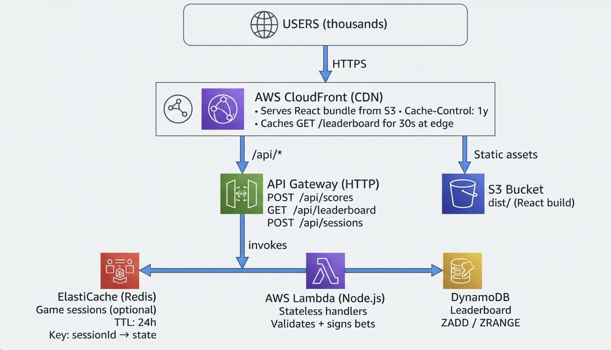

# Penny Mahjong — Hand Betting Game

A web-based Hand Betting Game using Mahjong tiles. Built for a technical assessment evaluating state management architecture, UI polish, and code scalability.

## Setup

```bash
npm install
npm run dev
```

Then open [http://localhost:5173](http://localhost:5173).

To build for production:

```bash
npm run build
npm run preview
```

## How to Play

1. **Land** on the home screen and press **New Game**.
2. Your current hand of 4 tiles is displayed with its total value.
3. Predict whether the **next hand's total will be higher or lower** than the current one.
4. If you guess correctly, you score points equal to the current hand's total.
5. The game ends when:
   - Any tile's value hits **0** or **10** (dynamic scaling for non-number tiles).
   - The deck is **reshuffled 3 times**.
6. On game over, submit your name to the **leaderboard** (top 5 stored locally).

## Architecture

```
src/
├── engine/
│   ├── tiles.js              # Tile creation, deck, shuffling, pure helpers
│   ├── gameEngine.js         # Pure state transitions (initGameState, placeBet)
│   └── leaderboard.js        # localStorage-backed leaderboard
├── context/
│   └── GameContext.jsx       # useReducer + Context — single source of truth
├── components/
│   ├── Tile.jsx              # Individual tile renderer
│   ├── HandDisplay.jsx       # Current hand + history entry
│   ├── BettingControls.jsx
│   ├── DeckInfo.jsx          # Draw/Discard/Reshuffle counts
│   └── TileValueRadar.jsx    # Live Dragon/Wind health bars
├── views/
│   ├── LandingPage.jsx
│   ├── GameScreen.jsx
│   └── GameOverScreen.jsx
└── styles/
    └── index.css             # Design tokens + all component styles
```

**Key design decisions for extensibility:**
- `gameEngine.js` is pure functions — no React, no side effects. New game rules = new functions added there.
- `useReducer` + named `ACTION` constants make it trivial to add new game actions.
- `TILE_TYPES`, `SUITS`, constants are exported from `tiles.js` — easy to add tile variants.
- CSS uses design tokens (`--color-*`, `--radius-*`) — theme changes are one-line edits.

## AI Utilization

**Handwritten:**
- `checkTileValuesGameOver` in `gameEngine.js` — the global tile value registry approach and game-over conditions (tile hits 0 or 10) were designed and reasoned through manually, including the edge case that scaling must check the updated registry after each round, not individual tile objects
- `TileValueRadar.jsx` — the health bar component including color thresholds, danger pulse animation, and the midline marker concept were implemented by hand
- Component API design (prop interfaces, context shape)
- CSS design system (color tokens, animations, responsive breakpoints)

**AI-assisted (Claude Code):**
- Boilerplate scaffolding and file structure setup
- CSS property lookups and cross-browser compatibility checks
- Iterative debugging during implementation

## Scaling to Production

The game engine runs entirely client-side — zero server load per active player during gameplay. The only backend touchpoint is the leaderboard (on game start and game over).



| Layer | Service | Purpose |
|---|---|---|
| CDN | AWS CloudFront | Serves React bundle from S3, caches leaderboard GET at edge (30s TTL) |
| Static hosting | S3 | React production build |
| API | API Gateway + Lambda | Stateless score submission and leaderboard reads |
| Leaderboard | ElastiCache (Redis) | Sorted set — `ZADD` / `ZRANGE`, O(log N) |
| Sessions | DynamoDB | Optional game state persistence, TTL 24h |

Swapping `leaderboard.js` from `localStorage` to `fetch('/api/scores')` is the only code change required. The engine, state, and all components are untouched.

## Tech Stack

- **React 18** + Vite
- Vanilla CSS (no UI library — demonstrates CSS capability directly)
- `localStorage` for leaderboard persistence
- Zero runtime dependencies beyond React
